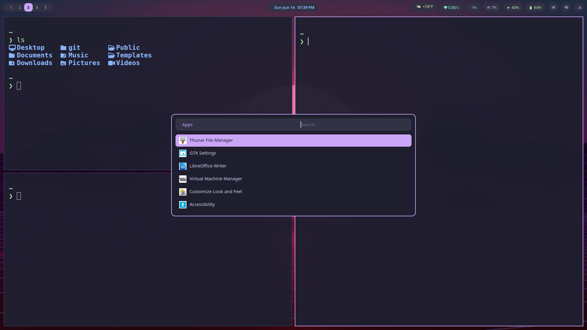

# debian-sway

Debian 12 (Bookworm) and Debian 13 (Trixie) daily-driver build — Sway + Wayland

Catppuccin Mocha theme throughout. Pill-style Waybar. No GNOME dependencies. Tried to create a fun looking Debian (Wayland) Sway build that sort of has a hyprland feel. Just Sway though, not SwayFX



## Stack

| Layer | Choice |
|---|---|
| Compositor | Sway (Wayland, i3-compatible) |
| Bar | Waybar |
| Launcher | Rofi (Wayland) |
| Terminal | Kitty |
| Notifications | Mako |
| Display manager | LightDM |
| Audio | PipeWire + WirePlumber |
| Wallpaper | swaybg |
| File manager | Thunar |
| Shell | Zsh + Starship prompt |
| Lock screen | Swaylock |

## Waybar modules

- **Left** — Sway workspace numbers
- **Center** — clock/date; hover for calendar
- **Right** — weather (Louisville, KY; hover for forecast) · network · CPU · RAM · volume · battery · idle inhibitor · tray

## Key bindings (Super = Win key)

| Binding | Action |
|---|---|
| `Super+Return` | Terminal (Kitty) |
| `Super+Space` | App launcher (Rofi) |
| `Super+x` | Power menu |
| `Super+Shift+e` | Lock screen |
| `Super+q` | Close window |
| `Super+f` | Fullscreen |
| `Super+Shift+f` | Toggle floating |
| `Super+b` | Firefox (workspace 2) |
| `Super+e` | Thunar (workspace 4) |
| `Super+Shift+w` | Random wallpaper |
| `Super+Shift+r` | Reload Sway config |
| `Super+r` | Resize mode |
| `Super+1–0` | Switch workspace |
| `Super+Shift+1–0` | Move window to workspace |
| `Print` | Screenshot (full) |
| `Super+Print` | Screenshot (region) |
| `Super+Shift+Print` | Screenshot to clipboard |
| 3-finger swipe | Switch workspace |

## Shell aliases

| Alias | Command |
|---|---|
| `c` | `clear` |
| `update` | `sudo nala update && upgrade` |
| `install` | `sudo nala install` |
| `speedtest` | `speedtest-cli --simple` |
| `swayconfig` | `vim ~/.config/sway/config` |
| `waybarconfig` | `vim ~/.config/waybar/config.jsonc` |
| `ff` | `fastfetch` |
| `ls` / `ll` / `lt` | `eza` with icons |
| `cat` | `bat --style=plain` |

## Install

Start from a minimal Debian install (no desktop environment selected in tasksel).

```bash
sudo apt install git -y
git clone https://github.com/jrabbott34/debian ~/git/debian
cd ~/git/debian
sudo bash install.sh
```

Reboot, select **Sway** from the LightDM session menu, log in.

## Layout

```
configs/
├── sway/
│   ├── config                  # keybinds, window rules, input, autostart
│   └── scripts/
│       ├── bg.sh               # swaybg wallpaper (--random flag)
│       └── workspace-nav.sh    # swipe to empty workspaces
├── waybar/
│   ├── config.jsonc
│   ├── style.css               # Catppuccin Mocha pills
│   └── scripts/
│       ├── weather.sh          # wttr.in Louisville KY (JSON + tooltip)
│       └── calendar-popup.sh   # yad calendar toggle
├── rofi/
│   ├── config.rasi
│   ├── catppuccin-mocha.rasi
│   └── scripts/powermenu.sh
├── kitty/kitty.conf
├── swaylock/config
├── mako/config
├── starship/starship.toml
└── shell/
    ├── aliases.sh
    └── zshrc
```
